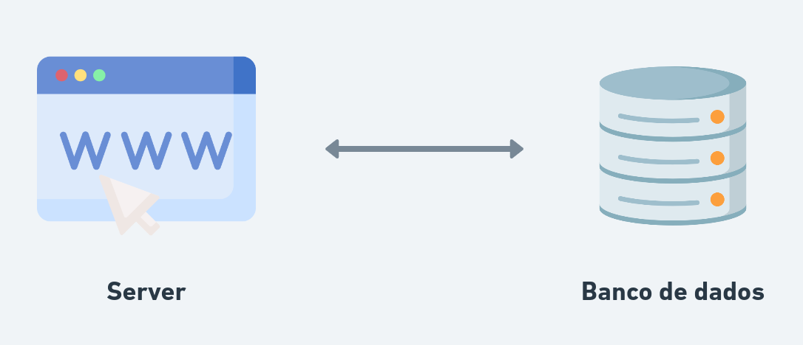
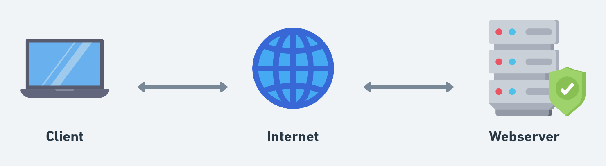
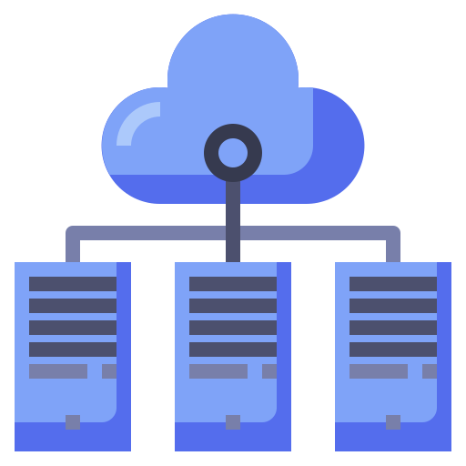
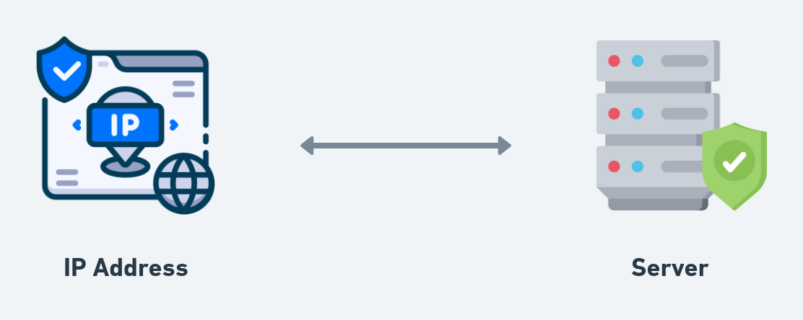
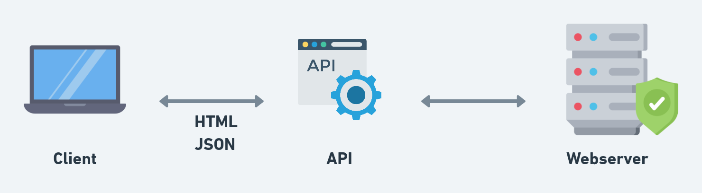

# Introduction to Web Development

**Web**:

- Infraestrutura;
- Tecnologias;
- Profissionais.

**Front-end:** Interação com o usuário.

**Back-end:**

- Webserver;
- Banco de dados;
- Arquitetura.

**WWW:** World Wide Web

**Server:** Fornece o acesso a outro computador. Geralmente este computadores estão interligados em um _datacenter_.

  

Datacenter

  
**Servidor** é um computador dedicado à execução de aplicações e serviços.  
**Webpage:** Imagens, textos, links, conteúdos.  
**Website:** Coleção de webpages.  
  
## Tipos de hospedagem
- Compartilhada: compartilha processamento, espaço, banda com outros sites;  
- VPS: Virtual Private Server;  
- Cloud Hosting: Servidores físicos e servidores virtuais.  
  
**Banda:** Quantidade máxima de dados que podem trafegar em uma conexão em uma determinada janela de tempo.  
  
## Comunicação entre cliente-servidor
Internet Protocol v4 e v6  
  

  
-> Dados trafegam através de **IP packets**, também conhecidos como **datagrams**.  
  
IP packet contém IP header e IP data.  
  
Assim como quando enviamos uma carta e ela pode ser perder, um pacote também poderia, certo?!  
Para evitar isso e garantir a integridade dos dados exite alguns protocolos:  
  
- TCP: Transmission Control Protocol;  
- UDP: User Datagram Protocol;  
  
Protocolo web: HTTP;  
Formato: Resquest-response.  
  
## Outros protocolos
- DHCP: Dynamic Host Configuration Protocol  
Protocolo usado quando o computador acessa uma network.  
- DNS: Domain Name System Protocol
Uaso para se comunicar de um nome de domínio para o IP referente.  
- IMAP: Internet Message Access Protocol
Protocolo utilizado para baixar e-mails.  
- SMTP: Simple Mail Transfer Protocol
Protocolo utilizado para enviar e-mails.  
- FTP: File Transfer Protocol
Usado para transferir arquivos de uma máquina local para um servidor.  
- SSH - Secure Shell Protocol:
    - Comunicação entre computadores;
    - Conexão com um servidor remoto para rodar comandos criptografados.
  
- SFTP - SSH File Transfer Protocol
Daos são transmitidos de maneira insegura utilizando apenas FTP, SFTP propicia transmitir arquivos através do protocolo SSH.  
  
## Frameworks
- Framework: Tem opinião (opinionated);
- Library: Não tem opinião (unopinionated).  
  
Também podemos identificar um *framework* a partir do grau de liberdade ao criar uma *feature*.  
  
  
  
Uma página pode ter conteúdo:
- Dinâmico;
- Estático.  
  
**Dinâmico:** É recebido a partir de uma interação do *webserver* com o *application server*.  
  
**Cache:** Dados de navegação armazenados.  
  
**SPA:** Single Page Application  
  
Processos de renderização do React:
- *Bundling:* HTML e demais arquivos necessários são enviados **imediatamente** pelo servidor;
- *Lazy loading:* HTML e demais arquivos são baixados, mas apenas o **mínimo necessário**.  
  
O processo de atualização do DOM feito pelo React se chama **reconciliation proccess**.  
  
O React utiliza o **Virtual DOM** para conseguir identificar as mudanças de estado que ocorrem e renderizar apenas o que foi alterado.  
  
**Processo de atualização de um estado:**
1. O Virtual DOM muda
2. O React compara o Virtual DOM atual com o anterior;
3. Os elementos alterados são alterados no Browser DOM;  
4. A página atualiza o conteúdo para conciliar com o Virtual DOM (mas apenas o que mudou).  
  
**- Fiber Architecture:** Renderiza a página de forma incremental conforme o conteúdo é requisitado.  
  
**React:**
- Performance;
- Responsividade (reatividade) para o usuário.
